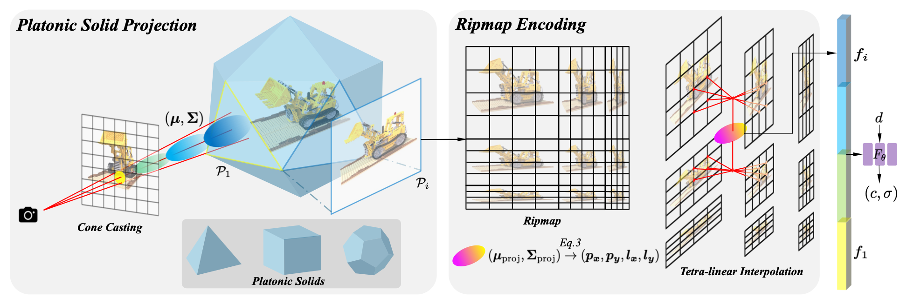
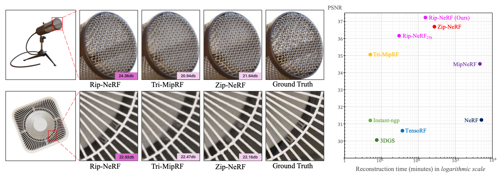

# Rip-NeRF

Official PyTorch implementation of the paper:

> **Rip-NeRF: Anti-aliasing Radiance Fields with Ripmap-Encoded Platonic Solids**
>
> ***SIGGRAPH 2024***
>
> Junchen Liu*, Wenbo Hu\*, Zhuo Yang\*, Jianteng Chen, Guoliang Wang, Xiaoxue Chen, Yantong Cai, Huang-ang Gao, Hao Zhao
>
> <a href='https://arxiv.org/abs/2405.02386'></a> <a href='https://junchenliu77.github.io/Rip-NeRF'></a>

<p align="center">

</p>
> To render a pixel, we first cast a cone for each pixel, and then divide the cone into multiple conical frustums, which are further            characterized by anisotropic 3D Gaussians parameterized by their mean and covariance (𝝁, 𝚺). Next, to featurize a 3D Gaussian, we project it onto the unparalleled faces of the Platonic solid to form a 2D Gaussian (𝝁<sub>proj</sub>, 𝚺<sub>proj</sub>), while the Platonic solid's faces are represented by the Ripmap Encoding with learnable parameters. Subsequently, we perform tetra-linear interpolation on the Ripmap Encoding to query corresponding feature vectors for the 2D Gaussian, where the position and level used in the interpolation are determined by the mean and covariance of the 2D Gaussian, respectively. Finally, feature vectors from all Platonic solids' faces and the encoded view direction are aggregated together to estimate the color and density of the conical frustums by a tiny MLP.


<p align="center">

</p>
> Qualitative and quantitative results of our Rip-NeRF and several representative baseline methods, e.g. Zip-NeRF, Tri-MipRF, etc. Rip-NeRF<sub>25k</sub> is a variant of Rip-NeRF that reduces the training iterations from 120𝑘 to 25𝑘 for better efficiency. The first and second rows in the left panel are results from the multi-scale Blender dataset and our newly captured real-world dataset, respectively. Our Rip-NeRF can render high-fidelity and aliasing-free images from novel viewpoints while maintaining efficiency.

## **Installation**
We use Python 3.9. Please install the following dependencies first
- [PyTorch (1.13.1 + cu11.6)](https://pytorch.org/get-started/locally/) 
- [tiny-cuda-nn](https://github.com/NVlabs/tiny-cuda-nn)

And then install the following dependencies using *pip*
```shell
pip3 install absl-py \
    gin-config==0.5.0 \
    loguru==0.6.0 \
    matplotlib \
    nerfacc==0.3.5 \
    numpy==1.23.3 \
    open3d==0.16.0 \
    opencv-python==4.6.0.66 \
    Pillow==9.2.0 \
    rich==12.6.0 \
    tensorboardX \
    termcolor \
    torchmetrics==0.10.0 \
    torchmetrics[image] \
    torchtyping==0.1.4 \
    tqdm==4.64.1
```

## **Data**

### nerf_synthetic dataset
Please download and unzip `nerf_synthetic.zip` from the [NeRF official Google Drive](https://drive.google.com/drive/folders/128yBriW1IG_3NJ5Rp7APSTZsJqdJdfc1).

### Generate multiscale dataset
Please generate it by
```shell
python scripts/convert_blender_data.py --blenderdir /path/to/nerf_synthetic --outdir /path/to/nerf_synthetic_multiscale
```

## **Training and evaluation**
```shell
python main.py --ginc config_files/ms_blender.gin 
```

## **Citation**

If you find the code useful for your work, please star this repo and consider citing:

```
@inproceedings{neuropara,
    title={Rip-NeRF: Anti-aliasing Radiance Fields with Ripmap-Encoded Platonic Solids},
    author={Junchen Liu and Wenbo Hu and Zhuo Yang and Jianteng Chen and Guoliang Wang and Xiaoxue Chen and Yantong Cai and Huan-ang Gao and Hao Zhao},
    year={2024},
    booktitle={SIGGRAPH'24 Conference Proceedings},
}
```


## **Related Work**

- [Mip-NeRF (ICCV 2021)](https://jonbarron.info/mipnerf/)
- [Instant-ngp (SIGGRAPH 2022)](https://nvlabs.github.io/instant-ngp/)
- [Tri-MipRF (ICCV 2023)](https://wbhu.github.io/projects/Tri-MipRF/)
- [Zip-NeRF (ICCV 2023)](https://jonbarron.info/zipnerf/)
